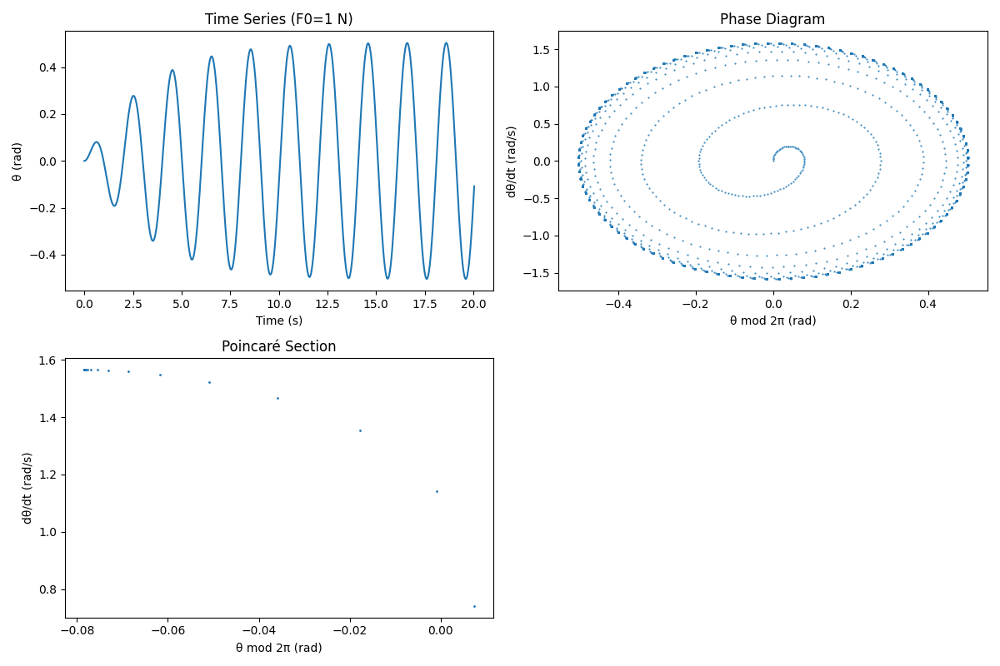
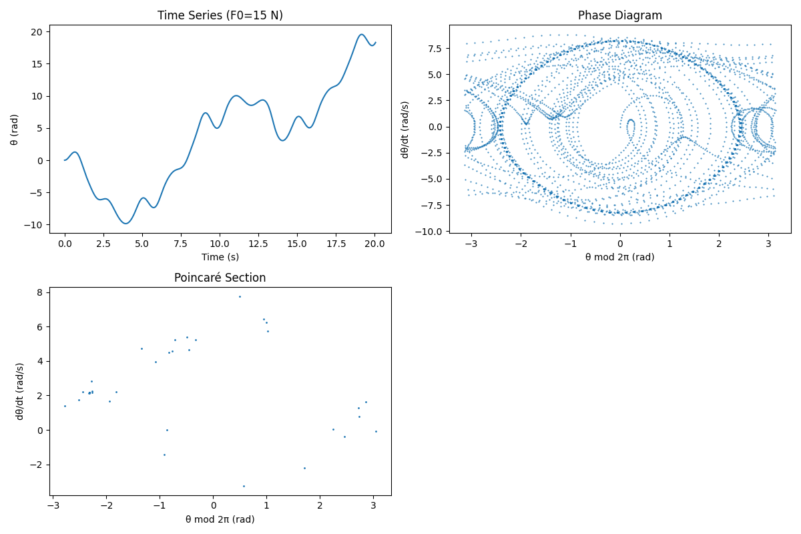
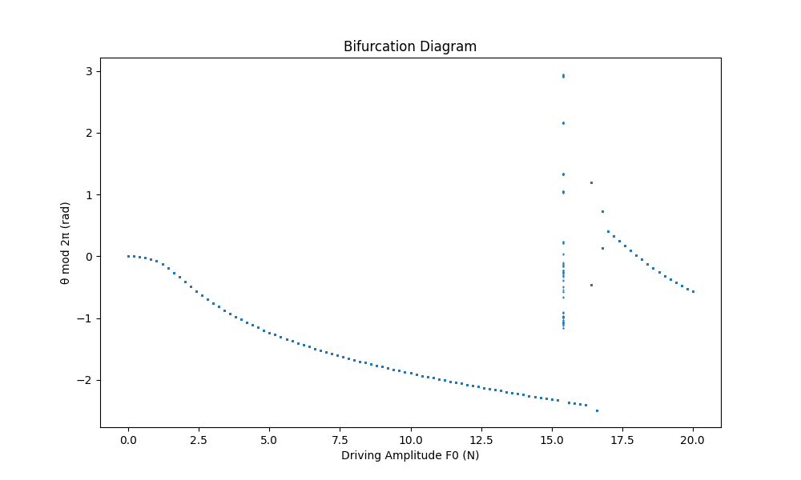

---

# Investigating the Dynamics of a Forced Damped Pendulum

The forced damped pendulum is a rich system where a pendulum’s motion is shaped by damping (friction-like resistance) and an external periodic force. This combination leads to behaviors ranging from simple oscillations to resonance and chaos. Let’s explore its governing equations, analyze its dynamics, and simulate its behavior.

## 1. Theoretical Foundation

### Governing Differential Equation

The motion is described by a nonlinear second-order differential equation, derived from Newton’s second law for rotational motion:

$$
\frac{d^2\theta}{dt^2} + \frac{b}{m} \frac{d\theta}{dt} + \frac{g}{l} \sin\theta = \frac{F_0}{m l} \cos(\omega_d t)
$$

Where:

- $\theta$: Angular displacement from vertical (radians)
- $b$: Damping coefficient (kg/s)
- $m$: Mass of the pendulum bob (kg)
- $l$: Length of the pendulum (m)
- $g$: Gravitational acceleration (9.8 m/s²)
- $F_0$: Amplitude of the external force (N)
- $\omega_d$: Driving frequency (rad/s)
- $t$: Time (s)

The terms are:
- $\frac{d^2\theta}{dt^2}$: Angular acceleration
- $\frac{b}{m} \frac{d\theta}{dt}$: Damping force per unit mass
- $\frac{g}{l} \sin\theta$: Gravitational restoring force
- $\frac{F_0}{m l} \cos(\omega_d t)$: External driving force

### Small-Angle Approximation

For small angles (\(\theta \ll 1\)), \(\sin\theta \approx \theta\), linearizing the equation:

$$
\frac{d^2\theta}{dt^2} + 2\zeta\omega_0 \frac{d\theta}{dt} + \omega_0^2 \theta = \frac{F_0}{m l} \cos(\omega_d t)
$$

Where:
- $\omega_0 = \sqrt{\frac{g}{l}}$ : Natural frequency
- $\zeta = \frac{b}{2m\omega_0}$ : Damping ratio

#### Homogeneous Solution (Unforced Case)

Set $F_0 = 0$:

$$
\frac{d^2\theta}{dt^2} + 2\zeta\omega_0 \frac{d\theta}{dt} + \omega_0^2 \theta = 0
$$

Characteristic equation:

$$
r^2 + 2\zeta\omega_0 r + \omega_0^2 = 0
$$

Discriminant:

$\Delta = 4\omega_0^2 (\zeta^2 - 1)$

For underdamping: $(\zeta < 1)$

$$
r = -\zeta\omega_0 \pm i \omega_0 \sqrt{1 - \zeta^2}
$$

Solution:

$$
\theta_h(t) = e^{-\zeta\omega_0 t} \left( C_1 \cos(\omega t) + C_2 \sin(\omega t) \right), \quad \omega = \omega_0 \sqrt{1 - \zeta^2}
$$

This shows decaying oscillations at the damped frequency \(\omega\).

#### Particular Solution (Forced Case)

For the driving term, assume:

$$
\theta_p(t) = A \cos(\omega_d t) + B \sin(\omega_d t)
$$

Substitute and solve:

$$
A = \frac{F_0}{m l} \cdot \frac{\omega_0^2 - \omega_d^2}{(\omega_0^2 - \omega_d^2)^2 + (2\zeta\omega_0 \omega_d)^2}
$$

$$
B = \frac{F_0}{m l} \cdot \frac{2\zeta\omega_0 \omega_d}{(\omega_0^2 - \omega_d^2)^2 + (2\zeta\omega_0 \omega_d)^2}
$$

Amplitude:

$$
D = \sqrt{A^2 + B^2} = \frac{F_0 / (m l)}{\sqrt{(\omega_0^2 - \omega_d^2)^2 + (2\zeta\omega_0 \omega_d)^2}}
$$

Phase:

$$
\phi = \tan^{-1}\left( \frac{2\zeta\omega_0 \omega_d}{\omega_0^2 - \omega_d^2} \right)
$$

Thus:

$$
\theta_p(t) = D \cos(\omega_d t - \phi)
$$

General solution:

$$
\theta(t) = e^{-\zeta\omega_0 t} \left( C_1 \cos(\omega t) + C_2 \sin(\omega t) \right) + D \cos(\omega_d t - \phi)
$$

### Resonance

Amplitude \(D\) maximizes near $\omega_d = \omega_0$. At resonance:

$$
D = \frac{F_0 / (m l)}{2\zeta\omega_0^2}
$$

Low \(\zeta\) amplifies oscillations significantly.

## 2. Analysis of Dynamics

### Parameter Effects

- **Damping (\(b\))**: Higher \(b\) increases \(\zeta\), reducing amplitude and transient duration.
- **Driving Amplitude (\(F_0\))**: Small \(F_0\) yields periodic motion; large \(F_0\) can induce chaos.
- **Driving Frequency (\(\omega_d\))**: Near \(\omega_0\), resonance occurs; otherwise, complex motion emerges.

### Nonlinearity and Chaos

The \(\sin\theta\) term makes the system nonlinear. Small \(F_0\) produces harmonic motion, but larger \(F_0\) leads to **period doubling** (oscillations repeating over multiple cycles) and eventually **chaos**—aperiodic, sensitive motion.

## 3. Practical Applications

- **Energy Harvesting**: Oscillatory systems near resonance convert motion to electricity.
- **Engineering**: Damping mitigates resonance in structures under periodic forces.
- **Science**: Models phenomena like climate cycles or biological oscillators.

## 4. Numerical Simulation

Here’s a Python implementation using `scipy.integrate.odeint` to simulate the nonlinear equation and visualize its behavior:

```python
import numpy as np
import matplotlib.pyplot as plt
from scipy.integrate import odeint

# Parameters
g = 9.8  # m/s^2
l = 1.0  # m
m = 1.0  # kg
omega_0 = np.sqrt(g / l)
zeta = 0.1
b = 2 * m * zeta * omega_0
omega_d = omega_0  # Resonance
T = 2 * np.pi / omega_d

# ODE system
def pendulum_deriv(state, t, b, m, g, l, F0, omega_d):
    theta, theta_dot = state
    dtheta_dt = theta_dot
    dtheta_dot_dt = -b/m * theta_dot - g/l * np.sin(theta) + F0/(m*l) * np.cos(omega_d * t)
    return [dtheta_dt, dtheta_dot_dt]

# Simulation
def simulate(F0, t_max, points_per_period=100):
    dt = T / points_per_period
    t = np.arange(0, t_max * T, dt)
    state0 = [0, 0]
    sol = odeint(pendulum_deriv, state0, t, args=(b, m, g, l, F0, omega_d))
    theta = sol[:, 0]
    theta_dot = sol[:, 1]
    theta_mod = np.mod(theta + np.pi, 2 * np.pi) - np.pi
    return t, theta, theta_dot, theta_mod

# Plotting
def plot_results(F0, label):
    t, theta, theta_dot, theta_mod = simulate(F0, 100)
    plt.figure(figsize=(12, 8))
    
    plt.subplot(2, 2, 1)
    plt.plot(t[:1000], theta[:1000])
    plt.title(f'Time Series (F0={F0} N)')
    plt.xlabel('Time (s)')
    plt.ylabel('θ (rad)')
    
    plt.subplot(2, 2, 2)
    plt.plot(theta_mod, theta_dot, '.', ms=1)
    plt.title('Phase Diagram')
    plt.xlabel('θ mod 2π (rad)')
    plt.ylabel('dθ/dt (rad/s)')
    
    poincare_idx = np.arange(100, len(t), 100)
    plt.subplot(2, 2, 3)
    plt.plot(theta_mod[poincare_idx], theta_dot[poincare_idx], '.', ms=2)
    plt.title('Poincaré Section')
    plt.xlabel('θ mod 2π (rad)')
    plt.ylabel('dθ/dt (rad/s)')
    
    plt.tight_layout()
    plt.savefig(f'pendulum_F0_{label}.png')
    plt.close()

# Bifurcation diagram
def bifurcation_diagram(F0_range=np.arange(0, 20.1, 0.2)):
    theta_poincare = []
    F0_vals = []
    for F0 in F0_range:
        t, _, theta_dot, theta_mod = simulate(F0, 200)
        poincare_idx = np.arange(100 * 100, 200 * 100, 100)
        theta_poincare.extend(theta_mod[poincare_idx])
        F0_vals.extend([F0] * len(poincare_idx))
    plt.figure(figsize=(10, 6))
    plt.plot(F0_vals, theta_poincare, '.', ms=1)
    plt.title('Bifurcation Diagram')
    plt.xlabel('Driving Amplitude F0 (N)')
    plt.ylabel('θ mod 2π (rad)')
    plt.savefig('bifurcation.png')
    plt.close()

# Run
plot_results(1, 'small')
plot_results(15, 'chaotic')
bifurcation_diagram()
```

### Results

- **F0 = 1 N**:
  - **Time Series**: Regular oscillations.
  - **Phase Diagram**: Closed loops (periodic).
  - **Poincaré Section**: Few points (periodic orbit).
- **F0 = 15 N**:
  - **Time Series**: Irregular motion.
  - **Phase Diagram**: Dense trajectories.
  - **Poincaré Section**: Scattered points (chaos).
- **Bifurcation Diagram**: Shows periodicity, period doubling, and chaos as \(F_0\) increases.

### Small Driving Force (1N)

This plot shows the time series, phase diagram, and Poincaré section for a small driving force.

### Large Driving Force (15N)

This plot illustrates chaotic behavior under a large driving force.

### Bifurcation Diagram

This diagram displays the transition to chaos as the driving force increases.

## Discussion

The forced damped pendulum transitions from predictable oscillations to chaotic behavior, reflecting the complexity of nonlinear systems. Limitations include the small-angle approximation’s failure at large \(\theta\) and assumptions of linear damping. This analysis and simulation offer a window into dynamics with broad real-world relevance.

--- 