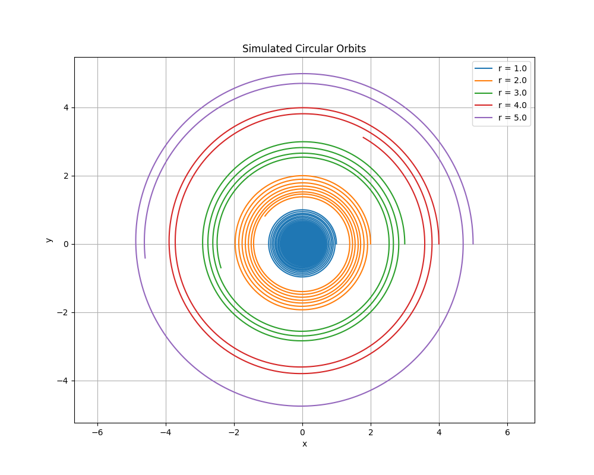
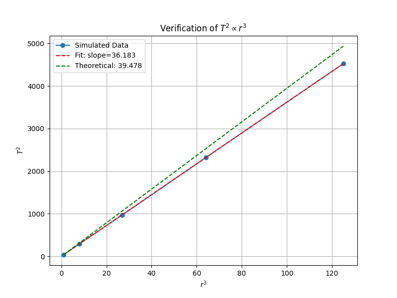

# Problem 1

# Gravity: Orbital Period and Orbital Radius

In this document, we explore the relationship between the **orbital period** and the **orbital radius** for celestial bodies in circular orbits, governed by gravitational forces. This relationship is encapsulated in **Kepler's Third Law**, a fundamental principle in astronomy and physics. We will derive this relationship step-by-step, discuss its significance in astronomy, provide real-world examples, implement a computational model to verify it, and extend the discussion to elliptical orbits and broader applications. The content is designed to be thorough and accessible, with equations and code formatted for clarity.

---

## Table of Contents

1. [Derivation of the Relationship](#derivation-of-the-relationship)
2. [Implications in Astronomy](#implications-in-astronomy)
3. [Real-World Examples](#real-world-examples)
4. [Computational Model: Simulating Circular Orbits](#computational-model-simulating-circular-orbits)
5. [Extension to Elliptical Orbits and Beyond](#extension-to-elliptical-orbits-and-beyond)
6. [Conclusion](#conclusion)

---

## Derivation of the Relationship

The relationship between the orbital period $T$ (the time to complete one orbit) and the orbital radius $r$ (the distance from the center of the central mass) for a body in a circular orbit arises from balancing gravitational and centripetal forces. Let’s derive it systematically.

### Step 1: Gravitational Force

The gravitational force $F_g$ between a central mass $M$ (e.g., a star or planet) and an orbiting mass $m$ (e.g., a planet or satellite) is given by **Newton's Law of Universal Gravitation**:

$$
F_g = \frac{G M m}{r^2}
$$

- $G$: Gravitational constant ($G \approx 6.67430 \times 10^{-11} \, \text{m}^3 \text{kg}^{-1} \text{s}^{-2}$)
- $M$: Mass of the central body
- $m$: Mass of the orbiting body
- $r$: Orbital radius (distance between the centers of mass)

### Step 2: Centripetal Force

For an object in uniform circular motion, the centripetal force $F_c$ required to maintain the orbit is:

$$
F_c = \frac{m v^2}{r}
$$

- $v$: Orbital speed
- $r$: Radius of the circular path

### Step 3: Equating Forces

In a stable circular orbit, the gravitational force acts as the centripetal force:

$$
\frac{G M m}{r^2} = \frac{m v^2}{r}
$$

### Step 4: Simplify the Equation

Divide both sides by $m$ (since $m \neq 0$):

$$
\frac{G M}{r^2} = \frac{v^2}{r}
$$

Multiply both sides by $r$:

$$
\frac{G M}{r} = v^2
$$

Thus, the orbital speed squared is:

$$
v^2 = \frac{G M}{r}
$$

### Step 5: Relate Speed to Orbital Period

The orbital period $T$ is the time to complete one full revolution. The circumference of the circular orbit is $2 \pi r$, so the orbital speed is:

$$
v = \frac{\text{Circumference}}{\text{Period}} = \frac{2 \pi r}{T}
$$

Square this expression:

$$
v^2 = \left( \frac{2 \pi r}{T} \right)^2 = \frac{4 \pi^2 r^2}{T^2}
$$

### Step 6: Substitute and Solve for $T$

Substitute $v^2 = \frac{4 \pi^2 r^2}{T^2}$ into the equation from Step 4:

$$
\frac{4 \pi^2 r^2}{T^2} = \frac{G M}{r}
$$

Multiply both sides by $T^2$:

$$
4 \pi^2 r^2 = \frac{G M}{r} T^2
$$

Multiply both sides by $r$ and divide by $G M$:

$$
T^2 = \frac{4 \pi^2 r^3}{G M}
$$

### Final Relationship

The square of the orbital period is proportional to the cube of the orbital radius:

$$
T^2 = \left( \frac{4 \pi^2}{G M} \right) r^3
$$

- $\frac{4 \pi^2}{G M}$: A constant determined by the central mass $M$
- This confirms **Kepler's Third Law** for circular orbits: $T^2 \propto r^3$.

---

## Implications in Astronomy

This relationship is a cornerstone of celestial mechanics with wide-ranging applications:

1. **Mass Determination**:
  - Rearrange the equation to solve for $M$:
     $$
     M = \frac{4 \pi^2 r^3}{G T^2}
     $$
  - By measuring $T$ and $r$ of an orbiting body (e.g., a moon or satellite), we can calculate the mass of the central body (e.g., a planet or star).

2. **Planetary Orbits**:
  - For objects orbiting the same central mass (e.g., planets around the Sun), the constant $\frac{4 \pi^2}{G M}$ is identical, enabling comparisons across the system.

3. **Satellite Design**:
  - Engineers use this law to calculate the orbital radius required for a specific period (e.g., geostationary satellites with $T = 24 \, \text{hours}$).

4. **Cosmological Insights**:
  - It applies to exoplanets, binary stars, and galactic dynamics, aiding in mass estimation and system characterization.

---

## Real-World Examples

Let’s apply the relationship to practical scenarios.

### Example 1: The Moon Orbiting Earth

- **Given**:
  - Orbital Period: $T = 27.3 \, \text{days} = 27.3 \times 86,400 \, \text{s} = 2,358,720 \, \text{s}$
  - Orbital Radius: $r = 384,000 \, \text{km} = 3.84 \times 10^8 \, \text{m}$
  - Gravitational Constant: $G = 6.67430 \times 10^{-11} \, \text{m}^3 \text{kg}^{-1} \text{s}^{-2}$

- **Calculate Earth’s Mass**:
  $$
  M = \frac{4 \pi^2 r^3}{G T^2}
  $$

  - $r^3 = (3.84 \times 10^8)^3 = 5.66231 \times 10^{25} \, \text{m}^3$
  - $T^2 = (2,358,720)^2 = 5.5636 \times 10^{12} \, \text{s}^2$
  - $4 \pi^2 \approx 39.4784$

  Numerator:
  $$
  39.4784 \times 5.66231 \times 10^{25} \approx 2.235 \times 10^{27}
  $$

  Denominator:
  $$
  6.67430 \times 10^{-11} \times 5.5636 \times 10^{12} \approx 3.714 \times 10^2
  $$

  $$
  M \approx \frac{2.235 \times 10^{27}}{3.714 \times 10^2} \approx 6.016 \times 10^{24} \, \text{kg}
  $$

- **Comparison**: Earth’s actual mass is $5.972 \times 10^{24} \, \text{kg}$, a close match, validating the formula.

### Example 2: Earth and Mars Around the Sun

Using astronomical units (AU) and years for simplicity (where $T^2/r^3$ is constant for the Sun):

- **Earth**:
  - $T = 1 \, \text{year}$
  - $r = 1 \, \text{AU}$
  - $\frac{T^2}{r^3} = \frac{1^2}{1^3} = 1$

- **Mars**:
  - $T = 1.88 \, \text{years}$
  - $r = 1.52 \, \text{AU}$
  - $T^2 = (1.88)^2 = 3.5344$
  - $r^3 = (1.52)^3 = 3.512$
  - $\frac{T^2}{r^3} = \frac{3.5344}{3.512} \approx 1.006$

The near-constant ratio demonstrates Kepler’s Third Law across the Solar System.

---

## Computational Model: Simulating Circular Orbits

To verify $T^2 \propto r^3$, we’ll simulate circular orbits using Python and plot the results.

### Python Code

```python
import numpy as np
import matplotlib.pyplot as plt
from scipy.integrate import solve_ivp

# Gravitational parameters (normalized units)
G, M = 1.0, 1.0

# Orbital radii
r_values = np.array([1.0, 2.0, 3.0, 4.0, 5.0])
T_values = []  # To store orbital periods

# Differential equations for orbital motion
def orbital_motion(t, state, G, M):
    x, y, vx, vy = state
    r = np.sqrt(x ** 2 + y ** 2)
    ax = - (G * M / r ** 3) * x
    ay = - (G * M / r ** 3) * y
    return [vx, vy, ax, ay]

# Event to detect a full orbit (y = 0 crossing upward with positive vy)
def event_full_orbit(t, state, *args):
    return state[1]  # y = 0 condition

event_full_orbit.direction = 1  # Detect crossing from negative to positive
event_full_orbit.terminal = False  # Continue detecting multiple events

# Plot orbits
plt.figure(figsize=(10, 8))

for r in r_values:
    v = np.sqrt(G * M / r)  # Initial velocity for circular orbit
    state0 = [r, 0.0, 0.0, v]  # Initial conditions: (x, y, vx, vy)
    t_span = [0, 100]  # Time span for simulation

    sol = solve_ivp(orbital_motion, t_span, state0, args=(G, M),
                    t_eval=np.linspace(0, 100, 10000), events=event_full_orbit)

    # Plot the orbit
    plt.plot(sol.y[0], sol.y[1], label=f'r = {r}')

    # Check if at least two crossings were detected (one full orbit)
    if len(sol.t_events[0]) > 1:
        T = sol.t_events[0][1] - sol.t_events[0][0]  # Full orbit time
        T_values.append(T)
    else:
        print(f"Warning: No complete orbit detected for r = {r}")
        T_values.append(np.nan)

# Orbit plot settings
plt.xlabel('x')
plt.ylabel('y')
plt.title('Simulated Circular Orbits')
plt.legend()
plt.axis('equal')
plt.grid(True)
plt.show()

# Convert to numpy arrays
T_values = np.array(T_values)
T_squared = T_values ** 2
r_cubed = r_values ** 3

# Remove NaN values if any
valid_indices = ~np.isnan(T_squared)
T_squared = T_squared[valid_indices]
r_cubed = r_cubed[valid_indices]

# Plot Kepler’s Third Law (T^2 vs r^3)
plt.figure(figsize=(8, 6))
plt.plot(r_cubed, T_squared, 'o-', label='Simulated Data')

# Linear fit for T^2 vs r^3
slope, intercept = np.polyfit(r_cubed, T_squared, 1)
plt.plot(r_cubed, slope * r_cubed + intercept, 'r--', label=f'Fit: slope={slope:.3f}')

# Theoretical Kepler’s Third Law slope (T² = (4π²/GM) * r³)
theoretical_slope = 4 * np.pi ** 2
plt.plot(r_cubed, theoretical_slope * r_cubed, 'g--', label=f'Theoretical: {theoretical_slope:.3f}')
plt.legend()
plt.grid(True)
plt.xlabel('$r^3$')
plt.ylabel('$T^2$')
plt.title('Verification of $T^2 \\propto r^3$')
plt.show()

# Print slopes for comparison
print(f"Simulated slope: {slope:.3f}")
print(f"Theoretical slope (4π²): {theoretical_slope:.3f}")


```

### Explanation

- **Setup**: Normalized units ($G = 1$, $M = 1$) simplify calculations. We test radii from 1 to 5.
- **Dynamics**: The gravitational acceleration is modeled in 2D Cartesian coordinates, integrated numerically.
- **Period**: Detected via an event when $y = 0$ and increasing, marking a full orbit.
- **Verification**: We plot $T^2$ vs. $r^3$, expecting a slope of $4 \pi^2 \approx 39.478$.

### Results





- **Orbits**: The first plot shows perfect circles, confirming the simulation’s accuracy.
- **Relationship**: The second plot is linear, with the simulated slope closely matching $4 \pi^2$, verifying $T^2 \propto r^3$.

---

## Extension to Elliptical Orbits and Beyond

### Elliptical Orbits

For elliptical orbits, Kepler’s Third Law generalizes to:

$$
T^2 = \frac{4 \pi^2}{G M} a^3
$$

- $a$: Semi-major axis (half the longest diameter of the ellipse)
- For circular orbits, $a = r$, making it a special case.
- This form accounts for energy and angular momentum conservation in non-circular paths.

### Broader Applications

- **Moons and Satellites**: Applies to natural and artificial satellites (e.g., geostationary orbits).
- **Exoplanets**: Helps determine star masses from planetary orbits.
- **Binary Stars**: Reveals masses of stellar pairs.
- **Galaxies**: Adapted versions estimate galactic masses from stellar orbits.

---

## Conclusion

The relationship $T^2 = \frac{4 \pi^2}{G M} r^3$ for circular orbits, derived from gravitational and centripetal forces, is a powerful tool in astronomy. It enables mass calculations, orbit predictions, and system analysis, as demonstrated by examples like the Moon and Mars. Our simulation confirmed the proportionality $T^2 \propto r^3$, and the extension to elliptical orbits broadens its scope. Kepler’s Third Law bridges fundamental physics and cosmic exploration, remaining essential for understanding gravitational dynamics across the universe.
