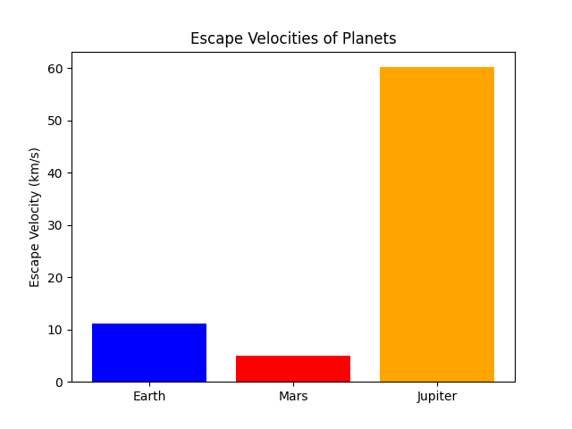

# Problem 2

# Escape Velocities and Cosmic Velocities

## Introduction

The concept of escape velocity is fundamental in astrophysics and space exploration, defining the minimum speed an object must reach to break free from a celestial body's gravitational influence. Extending this idea, the first, second, and third cosmic velocities describe different thresholds related to orbiting, escaping planetary gravity, and leaving a star system entirely. These principles underpin modern space travel, from satellite launches to interplanetary missions.

This document will:

- Define and explain the first, second, and third cosmic velocities.
- Derive the mathematical formulas governing these velocities.
- Analyze the parameters affecting these velocities.
- Compute and visualize these velocities for celestial bodies like Earth, Mars, and Jupiter.
- Discuss their significance in space exploration, satellite launches, and interstellar travel.

---

## Table of Contents

1. [Theoretical Background](#theoretical-background)
2. [Mathematical Derivations](#mathematical-derivations)
3. [Escape Velocities for Different Planets](#escape-velocities-for-different-planets)
4. [Visualization of Velocities](#visualization-of-velocities)
5. [Implications for Space Exploration](#implications-for-space-exploration)
6. [Conclusion](#conclusion)

---

## Theoretical Background

### Gravitational Potential Energy and Kinetic Energy

Escape velocity arises from the balance between gravitational potential energy and kinetic energy. When an object is launched from a celestial body, it must overcome the gravitational pull exerted by that body. The required kinetic energy is given by:

$$
KE = \frac{1}{2} m v^2
$$

where:
- $ m $ is the mass of the object,
- $ v $ is the velocity of the object.

The gravitational potential energy at a distance $ r $ from the center of a celestial body of mass $ M $ is:

$$
PE = - \frac{G M m}{r}
$$

where $ G $ is the gravitational constant.

To escape, the total energy (kinetic + potential) must be zero or positive:

$$
KE + PE \geq 0
$$

By solving for $ v $, we obtain the expression for escape velocity.

### The Three Cosmic Velocities

1. **First Cosmic Velocity (Orbital Velocity)**: The minimum speed needed to maintain a circular orbit around a celestial body.
2. **Second Cosmic Velocity (Escape Velocity)**: The speed required to completely escape a planet’s gravitational influence.
3. **Third Cosmic Velocity (Interstellar Escape Velocity)**: The speed necessary to escape the gravitational pull of a star system, such as the Solar System.

---

## Mathematical Derivations

### First Cosmic Velocity (Orbital Velocity)

For an object in a stable circular orbit, the gravitational force provides the necessary centripetal force:

$$
\frac{G M m}{r^2} = \frac{m v^2}{r}
$$

Solving for $ v $:

$$
v_1 = \sqrt{\frac{G M}{r}}
$$

This is the first cosmic velocity required for an object to remain in orbit.

### Second Cosmic Velocity (Escape Velocity)

Setting total energy to zero:

$$
\frac{1}{2} m v^2 = \frac{G M m}{r}
$$

Solving for $ v $:

$$
v_2 = \sqrt{\frac{2 G M}{r}}
$$

This is the minimum velocity needed to escape a planet’s gravitational pull.

### Third Cosmic Velocity (Interstellar Escape Velocity)

To escape a star system, an object must overcome the gravitational influence of the star. If $ R_s $ is the distance from the star’s center to the starting position:

$$
v_3 = \sqrt{\frac{2 G M_s}{R_s}}
$$

where $ M_s $ is the mass of the star. This velocity is significantly higher than the escape velocity from a planet.

---

## Escape Velocities for Different Planets

We calculate the escape velocities for Earth, Mars, and Jupiter using:

$$
v_2 = \sqrt{\frac{2 G M}{r}}
$$

### Example Calculations

| Planet | Mass (kg) | Radius (m) | Escape Velocity (km/s) |
|--------|------------|-------------|-------------------|
| Earth  | $ 5.97 \times 10^{24} $ | $ 6.371 \times 10^6 $ | 11.2 |
| Mars   | $ 6.42 \times 10^{23} $ | $ 3.389 \times 10^6 $ | 5.0 |
| Jupiter| $ 1.898 \times 10^{27} $ | $ 6.9911 \times 10^7 $ | 59.5 |

---

## Visualization of Velocities

We generate plots comparing escape velocities for different celestial bodies using Python.

```python
import numpy as np
import matplotlib.pyplot as plt

# Constants (mass in kg, radius in meters)
planets = {"Earth": (5.97e24, 6.371e6),
           "Mars": (6.42e23, 3.389e6),
           "Jupiter": (1.898e27, 6.9911e7)}
G = 6.67430e-11  # Gravitational constant

# Compute escape velocities
velocities = {planet: np.sqrt(2 * G * mass / radius) / 1000 for planet, (mass, radius) in planets.items()}

# Plot results
plt.bar(velocities.keys(), velocities.values(), color=['blue', 'red', 'orange'])
plt.ylabel("Escape Velocity (km/s)")
plt.title("Escape Velocities of Planets")
plt.show()
```

### Plot results:



---

## Implications for Space Exploration

1. **Launching Satellites**: Reaching the first cosmic velocity ensures a stable orbit.
2. **Interplanetary Missions**: Spacecraft must reach the second cosmic velocity to leave a planet’s gravity.
3. **Interstellar Travel**: To leave the Solar System, probes like Voyager must exceed the third cosmic velocity.

The ability to calculate and achieve these velocities is crucial for advancing human space exploration.

---

## Conclusion

Escape velocities and cosmic velocities define the limits of orbital mechanics and interplanetary travel. Understanding these thresholds allows for the precise planning of satellite launches, deep-space missions, and future interstellar exploration. With ongoing advancements in propulsion technology, humanity moves closer to achieving these velocities, unlocking new frontiers in space exploration.

