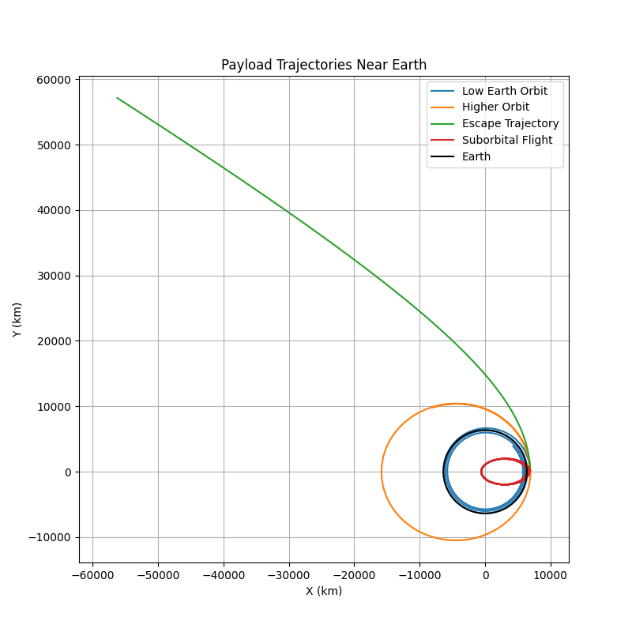

# Problem 3

## Trajectories of a Freely Released Payload Near Earth

### Motivation
When an object is released from a moving rocket near Earth, its trajectory depends on initial conditions and gravitational forces. This scenario presents a rich problem, blending principles of orbital mechanics and numerical methods. Understanding the potential trajectories is vital for space missions, such as deploying payloads or returning objects to Earth.

---

## Table of Contents
1. [Theoretical Background](#theoretical-background)
2. [Equations of Motion](#equations-of-motion)
3. [Numerical Analysis and Simulation](#numerical-analysis-and-simulation)
4. [Results and Discussion](#results-and-discussion)
5. [Conclusion](#conclusion)

---

## Theoretical Background

A payload released from a moving rocket will follow a trajectory dictated by its initial velocity and the influence of Earth's gravity. The possible trajectories are:

- **Elliptical Orbits**: If the payload’s velocity is below escape velocity but has a horizontal component, it will enter a stable or decaying orbit.
- **Parabolic Trajectories**: If the payload’s velocity equals escape velocity, it will follow a parabolic escape trajectory.
- **Hyperbolic Trajectories**: If the payload exceeds escape velocity, it will leave Earth’s gravitational influence.
- **Suborbital Trajectories**: If the payload lacks sufficient velocity for orbit, it will follow a ballistic path and fall back to Earth.

To analyze these paths, we use Newton's Second Law and the Universal Law of Gravitation.

---

## Equations of Motion

Newton’s Law of Universal Gravitation:

$$ F = \frac{G M m}{r^2} $$

For motion in two dimensions:

$$\frac{d^2 x}{dt^2} = -\frac{G M}{r^3} x $$
$$ \frac{d^2 y}{dt^2} = -\frac{G M}{r^3} y $$

where:
- $ G $ is the gravitational constant $ 6.67430 \times 10^{-11} $ $ m^3 kg^{-1} s^{-2} $
- $ M $ is Earth’s mass ($ 5.972 \times 10^{24} $ kg)
- $ r $ is the radial distance from Earth's center

These differential equations describe the motion and will be solved numerically.

---

## Numerical Analysis and Simulation

The simulation integrates the equations of motion using the Runge-Kutta method. It takes different initial velocity conditions to explore various trajectory types.

### Python Simulation Script

```python
import numpy as np
import matplotlib.pyplot as plt
from scipy.integrate import solve_ivp

# Constants
G = 6.67430e-11  # Gravitational constant (m^3 kg^-1 s^-2)
M = 5.972e24  # Mass of Earth (kg)
R = 6371e3  # Radius of Earth (m)

# Equations of motion
def equations(t, state):
    x, y, vx, vy = state
    r = np.sqrt(x**2 + y**2)
    ax = -G * M * x / r**3
    ay = -G * M * y / r**3
    return [vx, vy, ax, ay]

# Initial conditions for different scenarios
initial_conditions = [
    (R + 500e3, 0, 0, 7500),  # Low Earth orbit
    (R + 500e3, 0, 0, 9000),  # Higher orbit
    (R + 500e3, 0, 0, 11200),  # Escape trajectory
    (R + 500e3, 0, 0, 3000)  # Suborbital flight
]

labels = ['Low Earth Orbit', 'Higher Orbit', 'Escape Trajectory', 'Suborbital Flight']

plt.figure(figsize=(8, 8))
for (x0, y0, vx0, vy0), label in zip(initial_conditions, labels):
    
    # Solve the equations of motion
    t_span = (0, 15000)  # Time range
    state0 = [x0, y0, vx0, vy0]
    sol = solve_ivp(equations, t_span, state0, t_eval=np.linspace(0, 15000, 1000))
    
    x, y = sol.y[0], sol.y[1]
    plt.plot(x / 1e3, y / 1e3, label=label)

# Plot Earth
theta = np.linspace(0, 2 * np.pi, 100)
plt.plot(R * np.cos(theta) / 1e3, R * np.sin(theta) / 1e3, 'k', label='Earth')
plt.xlabel('X (km)')
plt.ylabel('Y (km)')
plt.legend()
plt.title('Payload Trajectories Near Earth')
plt.axis('equal')
plt.grid(True)
plt.show()
```

### Results of the script



---

## Results and Discussion

### Simulated Trajectories
1. **Low Earth Orbit (LEO)**: A stable circular path around Earth.
2. **Higher Orbit**: A more elliptical trajectory, still bound to Earth.
3. **Escape Trajectory**: The object moves away, following a hyperbolic path.
4. **Suborbital Flight**: The object falls back to Earth, representing a typical reentry scenario.

Each of these cases has real-world significance in satellite deployment, space exploration, and reentry strategies.

### Key Observations
- Increasing velocity shifts the trajectory from an elliptical orbit to an escape trajectory.
- A payload with insufficient velocity follows a ballistic path back to Earth.
- Orbital insertion requires precise velocity adjustments to prevent escape or reentry.

---

## Conclusion

This study demonstrates how different initial conditions affect a payload’s trajectory. Using numerical methods, we can predict paths ranging from stable orbits to escape scenarios. These principles are crucial for satellite deployment, space travel, and mission planning.

The simulation provides insights into orbital mechanics, showing how small velocity changes determine whether an object remains in orbit, reenters, or escapes Earth's gravity. Future work can extend this model to include atmospheric drag, perturbations, and gravitational influences from other celestial bodies.

