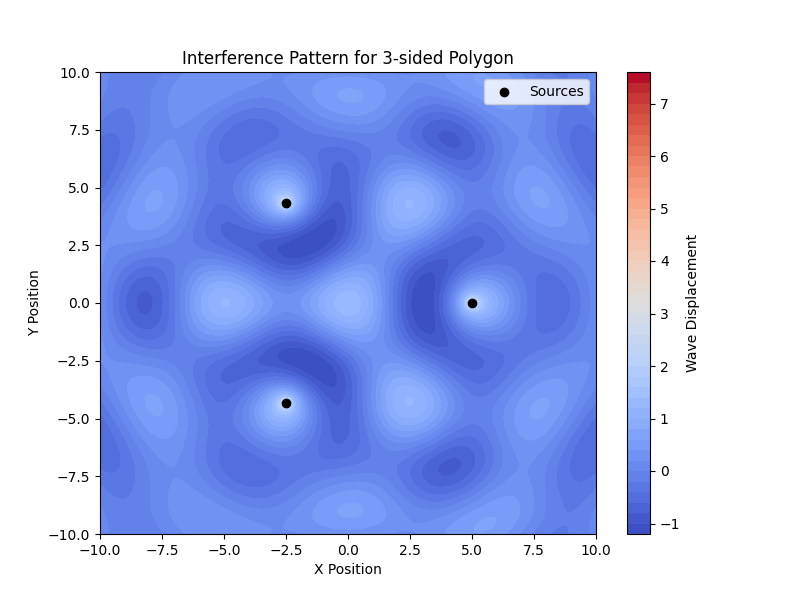
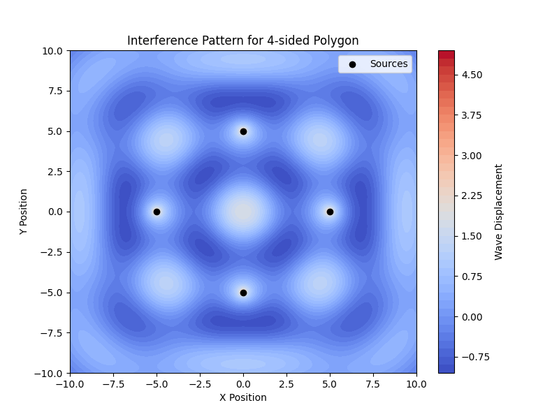
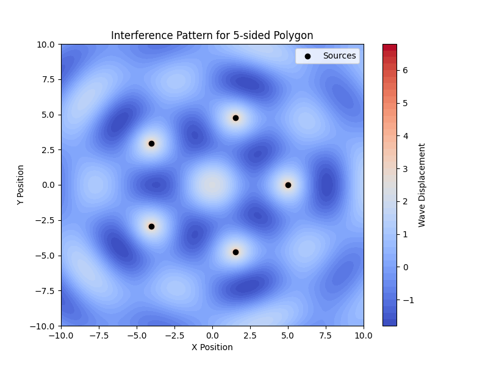
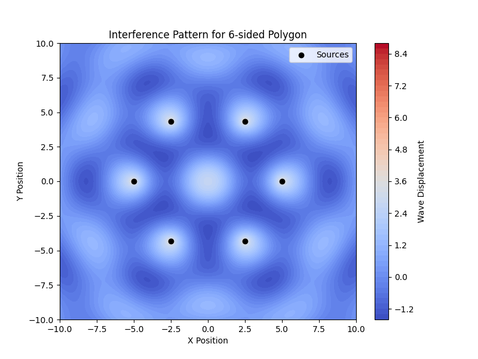
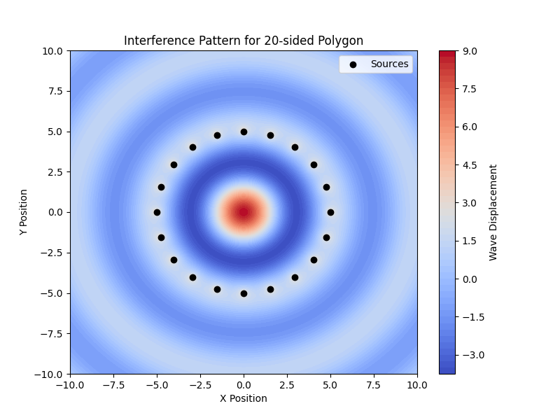
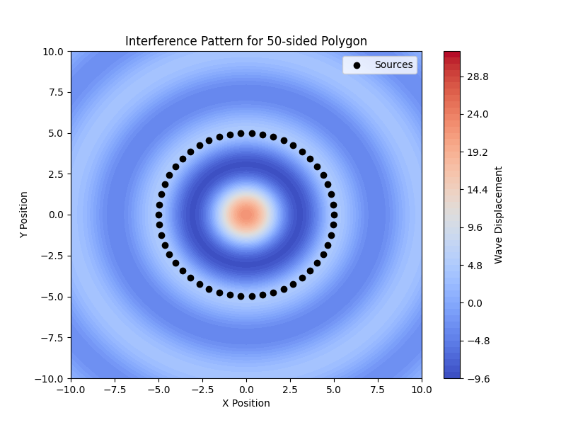
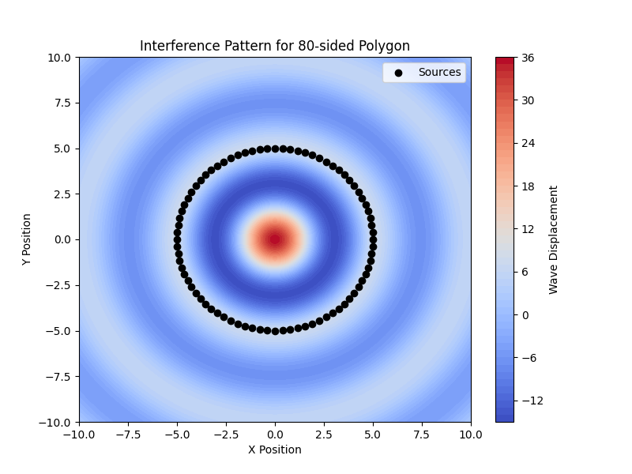

# Problem 1  

## **Interference Patterns on a Water Surface**
### **Motivation**
Interference occurs when waves from different sources overlap, forming new patterns. On a water surface, this phenomenon is observed when ripples from different sources meet, leading to constructive and destructive interference.  
- **Constructive interference** happens when wave crests or troughs align, amplifying the displacement.  
- **Destructive interference** occurs when a crest and a trough meet, canceling each other out.  

Studying these interference patterns enhances our understanding of wave physics and has applications in acoustics, optics, and electromagnetism.

---

## **Theoretical Background**
A point source on a water surface emits a circular wave described by the **Single Disturbance equation**:

$$
\eta(x, y, t) = \frac{A}{\sqrt{r}} \cos(kr - \omega t + \phi)
$$

where:  
- $\eta(x, y, t)$ is the displacement at point $(x, y)$ and time $t$.  
- $A$ is the amplitude of the wave.  
- $k = \frac{2\pi}{\lambda}$ is the wave number, where $\lambda$ is the wavelength.  
- $\omega = 2\pi f$ is the angular frequency, with $f$ being the frequency.  
- $r = \sqrt{(x - x_0)^2 + (y - y_0)^2}$ is the distance from the source to the point $(x, y)$.  
- $\phi$ is the initial phase.  

When multiple sources are placed at the vertices of a **regular polygon**, their waves superimpose, and the total displacement is:

$$
\eta_{\text{sum}}(x, y, t) = \sum_{i=1}^{N} \eta_i(x, y, t)
$$

where $N$ is the number of sources.

---

## **Simulation Plan**
We will:

 1. Choose a **regular polygon** (triangle, square, or pentagon).
 2. Place **wave sources** at its vertices.
 3. Compute **wave displacements** from each source.
 4. Sum them using **superposition**.
 5. **Visualize** the resulting interference patterns.

---

## **Python Simulation**
Below is a Python script that simulates the interference of circular waves from sources arranged in a chosen **regular polygon**. It uses **NumPy** and **Matplotlib** for calculations and visualization.

### **Install Required Libraries**
```python
import numpy as np
import matplotlib.pyplot as plt
```

### **Simulation Parameters**
```python
# Define wave parameters
A = 1         # Amplitude
lambda_ = 5   # Wavelength
k = 2 * np.pi / lambda_  # Wave number
f = 1         # Frequency
omega = 2 * np.pi * f    # Angular frequency
phi = 0       # Initial phase

# Grid size
x_range = np.linspace(-10, 10, 300)
y_range = np.linspace(-10, 10, 300)
X, Y = np.meshgrid(x_range, y_range)

# Time variable (static snapshot)
t = 0
```

### **Defining the Polygon Sources**
```python
def polygon_vertices(n, radius=5):
    """Returns coordinates of n vertices of a regular polygon."""
    angles = np.linspace(0, 2*np.pi, n, endpoint=False)
    return np.array([(radius * np.cos(a), radius * np.sin(a)) for a in angles])

# Choose number of sources (triangle, square, pentagon)
N_sources = 4  # Change to 3 for triangle, 5 for pentagon, etc.
sources = polygon_vertices(N_sources)
```

### **Computing Wave Interference**
```python
def wave_from_source(x0, y0, X, Y, t):
    """Computes the wave displacement from a single point source."""
    r = np.sqrt((X - x0)**2 + (Y - y0)**2) + 1e-6  # Avoid division by zero
    return (A / np.sqrt(r)) * np.cos(k * r - omega * t + phi)

# Superposition of waves from all sources
total_wave = np.zeros_like(X)

for x0, y0 in sources:
    total_wave += wave_from_source(x0, y0, X, Y, t)
```

### **Plotting the Interference Pattern**
```python
plt.figure(figsize=(8, 6))
plt.contourf(X, Y, total_wave, levels=50, cmap="coolwarm")
plt.colorbar(label="Wave Displacement")
plt.scatter(sources[:, 0], sources[:, 1], color='black', marker='o', label="Sources")
plt.xlabel("X Position")
plt.ylabel("Y Position")
plt.title(f"Interference Pattern for {N_sources}-sided Polygon")
plt.legend()
plt.show()
```

---

## **Analysis of Results**















1. **Wave Amplification (Constructive Interference)**  


     - Bright (red) regions represent wave crests reinforcing each other.  
     - These occur where the path difference between sources is an integer multiple of the wavelength.  

2. **Wave Cancellation (Destructive Interference)**


     - Dark (blue) regions indicate troughs canceling out.  
     - These form where the waves from different sources meet out of phase.  

3. **Pattern Characteristics** 


     - The **number of sources (N)** affects symmetry.  
     - Increasing $N$ creates more complex patterns with distinct nodal lines (regions of zero displacement).  
     - The **wavelength ($\lambda$)** controls the spacing of the interference bands.

---
## **Conclusion**
This simulation visualizes how wave sources arranged in a regular polygon create interference patterns on a water surface. The results highlight key wave properties like **constructive and destructive interference**, demonstrating the **superposition principle** in action.  

This study is useful in understanding wave behavior in physics and engineering applications, such as **optical interference**, **antenna array design**, and **acoustics**.
