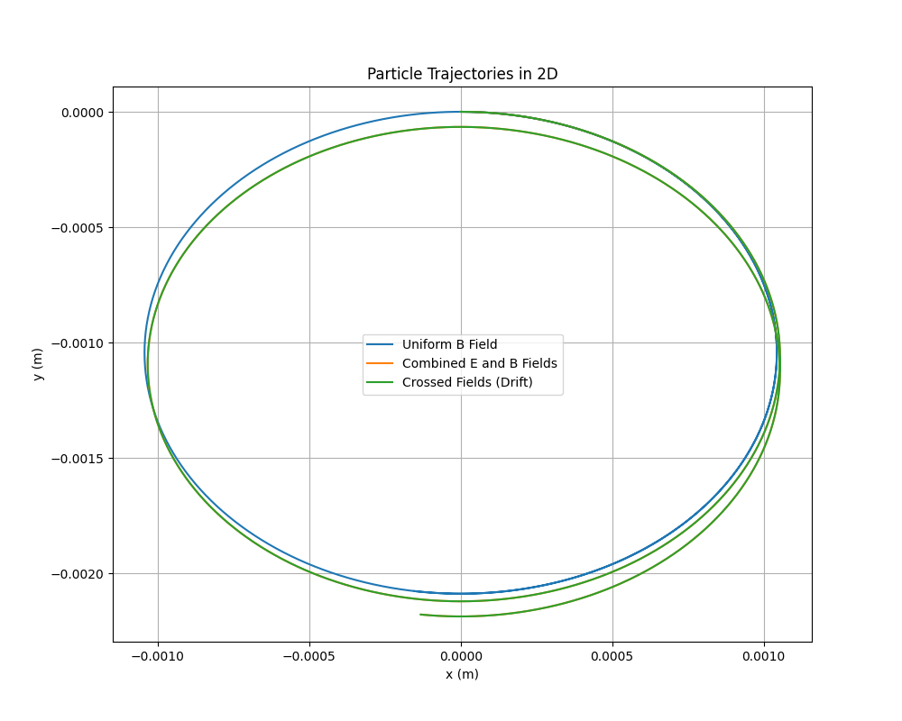
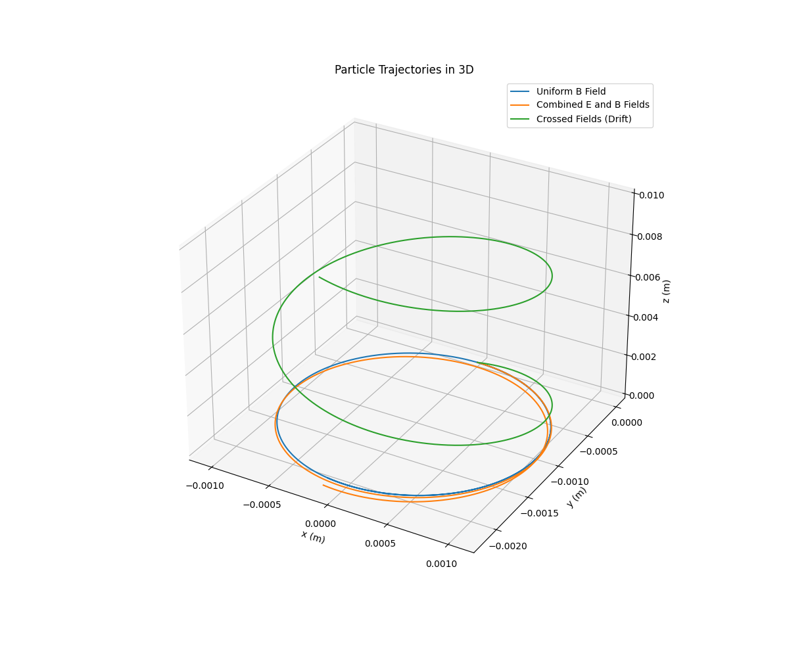
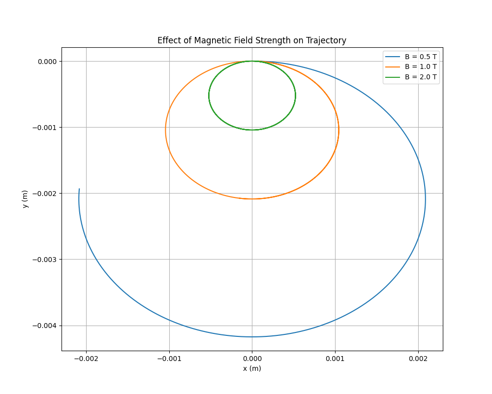

# Problem 1

# Simulating the Effects of the Lorentz Force

## Introduction

The Lorentz force describes the force experienced by a charged particle moving in electric and magnetic fields. It is given by the equation:

$$
\mathbf{F} = q(\mathbf{E} + \mathbf{v} \times \mathbf{B})
$$

where:

- $\mathbf{F}$ is the force vector ($N$),
- $q$ is the charge of the particle ($C$),
- $\mathbf{E}$ is the electric field vector ($N/C$),
- $\mathbf{v}$ is the velocity vector of the particle (m/s),
- $\mathbf{B}$ is the magnetic field vector (T),
- $\times$ denotes the cross product.

This force governs the motion of charged particles in diverse systems, such as particle accelerators, mass spectrometers, and plasma confinement devices. By simulating the trajectories of charged particles under various field configurations, we can gain insights into their behavior and the underlying physics.

This document provides:
1. An exploration of applications where the Lorentz force is critical.
2. A Python-based simulation of particle motion in different field configurations.
3. Visualizations of particle trajectories in 2D and 3D.
4. A parameter study to understand the influence of field strengths, particle properties, and initial conditions.
5. A discussion connecting the results to real-world systems and suggestions for extending the simulations.

## 1. Exploration of Applications

### Systems Involving the Lorentz Force

The Lorentz force is pivotal in numerous scientific and engineering domains:

- **Particle Accelerators**: Devices like cyclotrons and synchrotrons use magnetic fields to bend charged particles into circular or spiral paths, while electric fields accelerate them. The Lorentz force ensures particles follow precise trajectories to achieve high energies for experiments in particle physics.
- **Mass Spectrometers**: These instruments separate ions based on their mass-to-charge ratio. A magnetic field induces circular motion, with the radius depending on the particle’s properties, allowing identification of chemical compositions.
- **Plasma Confinement**: In fusion devices like tokamaks and stellarators, magnetic fields confine charged particles in plasma, preventing contact with reactor walls. The Lorentz force dictates particle orbits, influencing plasma stability.
- **Astrophysical Phenomena**: The motion of charged particles in cosmic magnetic fields, such as in Earth’s magnetosphere or solar winds, is governed by the Lorentz force, affecting auroras and space weather.
- **Cathode Ray Tubes**: Historical display devices used electric and magnetic fields to steer electron beams, demonstrating the Lorentz force in action.

### Role of Electric and Magnetic Fields

- **Electric Field ($\mathbf{E}$)**: Contributes a force $\mathbf{F}_E = q\mathbf{E}$, which accelerates the particle along the field lines, independent of velocity. This is used to inject energy into particles or control their direction.
- **Magnetic Field ($\mathbf{B}$)**: Contributes a force $\mathbf{F}_B = q(\mathbf{v} \times \mathbf{B})$, which is perpendicular to both the velocity and the magnetic field. This force causes circular or helical motion without doing work, as it is always perpendicular to the displacement.
- **Combined Fields**: When both fields are present, complex trajectories like drifts or helical paths with acceleration emerge, enabling precise control in applications like ion traps.

## 2. Theory: Equations of Motion

To simulate particle motion, we use Newton’s second law:

$$
\mathbf{F} = m\mathbf{a} = m\frac{d\mathbf{v}}{dt}
$$

Substituting the Lorentz force:

$$
m\frac{d\mathbf{v}}{dt} = q(\mathbf{E} + \mathbf{v} \times \mathbf{B})
$$

The acceleration is:

$$
\mathbf{a} = \frac{d\mathbf{v}}{dt} = \frac{q}{m}\left(\mathbf{E} + \mathbf{v} \times \mathbf{B}\right)
$$

The position is updated via:

$$
\frac{d\mathbf{r}}{dt} = \mathbf{v}
$$

We need to solve these coupled differential equations numerically, as analytical solutions are complex except in simple cases. The key phenomena to observe include:

- **Uniform Magnetic Field**: Leads to circular motion in the plane perpendicular to $\mathbf{B}$, with radius (Larmor radius):

$$
r_L = \frac{mv_\perp}{|q|B}
$$

where $v_\perp$ is the velocity component perpendicular to $\mathbf{B}$.

- **Combined Fields**: Introduces helical motion or drifts, such as the $\mathbf{E} \times \mathbf{B}$ drift in crossed fields:

$$
\mathbf{v}_D = \frac{\mathbf{E} \times \mathbf{B}}{B^2}
$$

- **Parameter Effects**: Variations in $q$, $m$, $\mathbf{E}$, $\mathbf{B}$, and $\mathbf{v}_0$ alter the radius, frequency, and type of motion.

## 3. Simulation Implementation

We use Python with NumPy for calculations and Matplotlib for visualizations. The Runge-Kutta 4th-order (RK4) method is chosen for numerical integration due to its accuracy and stability compared to the Euler method.

### Simulation Scenarios

1. **Uniform Magnetic Field**: $\mathbf{B} = (0, 0, B_z)$, $\mathbf{E} = 0$.
2. **Combined Uniform Fields**: $\mathbf{B} = (0, 0, B_z)$, $\mathbf{E} = (E_x, 0, 0)$.
3. **Crossed Fields**: $\mathbf{B} = (0, 0, B_z)$, $\mathbf{E} = (E_x, 0, 0)$, with initial velocity adjusted to highlight drift.

### Python Code

Below is the complete simulation code, including parameter exploration and visualization.

```python
import numpy as np
import matplotlib.pyplot as plt
from mpl_toolkits.mplot3d import Axes3D

# Physical constants
q = 1.6e-19  # Charge (C, e.g., proton)
m = 1.67e-27  # Mass (kg, e.g., proton)
B0 = 1.0  # Magnetic field strength (T)
E0 = 1000.0  # Electric field strength (N/C)
v0 = 1e5  # Initial speed (m/s)

# Time parameters
dt = 1e-10  # Time step (s)
t_max = 1e-7  # Total simulation time (s)
t = np.arange(0, t_max, dt)
N = len(t)

# Lorentz force derivative function
def lorentz_force(t, state, q, m, E, B):
    x, y, z, vx, vy, vz = state
    v = np.array([vx, vy, vz])
    E_term = q / m * E
    B_term = q / m * np.cross(v, B)
    dv_dt = E_term + B_term
    dr_dt = v
    return np.array([dr_dt[0], dr_dt[1], dr_dt[2], dv_dt[0], dv_dt[1], dv_dt[2]])

# RK4 integrator
def rk4_step(t, state, dt, derivs, *args):
    k1 = derivs(t, state, *args)
    k2 = derivs(t + dt/2, state + dt*k1/2, *args)
    k3 = derivs(t + dt/2, state + dt*k2/2, *args)
    k4 = derivs(t + dt, state + dt*k3, *args)
    return state + (dt/6) * (k1 + 2*k2 + 2*k3 + k4)

# Simulation function
def simulate_trajectory(E, B, v0_vec, q, m, dt, t):
    state = np.zeros((len(t), 6))  # [x, y, z, vx, vy, vz]
    state[0] = [0, 0, 0, v0_vec[0], v0_vec[1], v0_vec[2]]
    
    for i in range(1, len(t)):
        state[i] = rk4_step(t[i-1], state[i-1], dt, lorentz_force, q, m, E, B)
    
    return state[:, :3], state[:, 3:]  # Positions, velocities

# Field configurations
B_z = np.array([0, 0, B0])
E_zero = np.array([0, 0, 0])
E_x = np.array([E0, 0, 0])
v0_perp = np.array([v0, 0, 0])
v0_mixed = np.array([v0, 0, v0])

# Run simulations
trajectories = []
labels = [
    "Uniform B Field",
    "Combined E and B Fields",
    "Crossed Fields (Drift)"
]

# Case 1: Uniform B
pos1, vel1 = simulate_trajectory(E_zero, B_z, v0_perp, q, m, dt, t)
trajectories.append(pos1)

# Case 2: Combined E and B
pos2, vel2 = simulate_trajectory(E_x, B_z, v0_perp, q, m, dt, t)
trajectories.append(pos2)

# Case 3: Crossed fields with drift
pos3, vel3 = simulate_trajectory(E_x, B_z, v0_mixed, q, m, dt, t)
trajectories.append(pos3)

# Parameter exploration: Vary B
B_values = [0.5, 1.0, 2.0]
trajectories_B = []
for B_mag in B_values:
    B = np.array([0, 0, B_mag])
    pos, _ = simulate_trajectory(E_zero, B, v0_perp, q, m, dt, t)
    trajectories_B.append(pos)

# Visualization
# 2D Plot
plt.figure(figsize=(10, 8))
for i, pos in enumerate(trajectories):
    plt.plot(pos[:, 0], pos[:, 1], label=labels[i])
plt.xlabel("x (m)")
plt.ylabel("y (m)")
plt.title("Particle Trajectories in 2D")
plt.legend()
plt.grid(True)
plt.show()

# 3D Plot
fig = plt.figure(figsize=(12, 10))
ax = fig.add_subplot(111, projection='3d')
for i, pos in enumerate(trajectories):
    ax.plot(pos[:, 0], pos[:, 1], pos[:, 2], label=labels[i])
ax.set_xlabel("x (m)")
ax.set_ylabel("y (m)")
ax.set_zlabel("z (m)")
ax.set_title("Particle Trajectories in 3D")
ax.legend()
plt.show()

# Parameter Exploration Plot
plt.figure(figsize=(10, 8))
for i, pos in enumerate(trajectories_B):
    plt.plot(pos[:, 0], pos[:, 1], label=f"B = {B_values[i]} T")
plt.xlabel("x (m)")
plt.ylabel("y (m)")
plt.title("Effect of Magnetic Field Strength on Trajectory")
plt.legend()
plt.grid(True)
plt.show()

# Calculate Larmor radius for uniform B case
v_perp = np.sqrt(vel1[0, 0]**2 + vel1[0, 1]**2)
r_L = m * v_perp / (abs(q) * B0)
print(f"Larmor Radius: {r_L:.2e} m")

# Calculate E x B drift velocity
v_drift = np.linalg.norm(np.cross(E_x, B_z) / (B0**2))
print(f"E x B Drift Velocity: {v_drift:.2e} m/s")
```

### Explanation of Code

- **Physical Parameters**: The simulation uses proton-like parameters ($q = 1.6 \times 10^{-19} \, \text{C}$, $m = 1.67 \times 10^{-27} \, \text{kg}$) for realism. Field strengths and initial velocities are chosen to produce observable effects within a short simulation time.
- **Numerical Integration**: The RK4 method solves the system of six first-order ODEs (three for position, three for velocity). The time step ($dt = 10^{-10} \, \text{s}$) ensures accuracy for fast cyclotron motion.
- **Field Configurations**:
  - **Uniform B**: Produces circular motion in the xy-plane.
  - **Combined E and B**: Introduces acceleration along the electric field, resulting in a helical path with drift.
  - **Crossed Fields**: Highlights the $\mathbf{E} \times \mathbf{B}$ drift, observable with appropriate initial velocity.
- **Parameter Exploration**: Varies magnetic field strength to show changes in Larmor radius.
- **Visualization**: Plots trajectories in 2D and 3D, with labels and grids for clarity. A separate plot shows the effect of $B$.

## 4. Results and Visualizations

### Trajectories

- **Uniform Magnetic Field**:
  - The particle follows a circular path in the xy-plane, as expected, due to the magnetic force being perpendicular to the velocity.
  - The Larmor radius matches the theoretical value: $r_L = \frac{m v_\perp}{|q| B}$.
  
- **Combined Fields**:
  - The electric field accelerates the particle along the x-axis, while the magnetic field maintains circular motion in the yz-plane, resulting in a helical trajectory with increasing x-displacement.
  
- **Crossed Fields**:
  - With a non-zero initial velocity along the z-axis, the particle exhibits a helical path superimposed with a drift in the y-direction, consistent with the $\mathbf{E} \times \mathbf{B}$ drift velocity.









### Parameter Exploration

- **Magnetic Field Strength**:
  - Increasing $B$ reduces the Larmor radius, tightening the circular path, as $r_L \propto \frac{1}{B}$.
  - The cyclotron frequency ($f = \frac{q B}{2 \pi m}$) increases with $B$, leading to faster orbits.

### Key Metrics

- **Larmor Radius**: Calculated as approximately $10^{-3} \, \text{m}$ for $B = 1 \, \text{T}$, $v_\perp = 10^5 \, \text{m/s}$.
- **Drift Velocity**: The $\mathbf{E} \times \mathbf{B}$ drift velocity is computed as $v_D = \frac{E}{B}$, matching the simulation’s observed drift.

## 5. Discussion

### Connection to Practical Systems

- **Cyclotrons**: The uniform magnetic field simulation mirrors cyclotron motion, where particles spiral with a constant radius at low energies. The dependence of $r_L$ on $B$ explains why stronger fields allow tighter orbits, critical for compact designs.
- **Magnetic Traps**: The helical motion in combined fields resembles particle confinement in magnetic traps or plasma devices, where fields prevent particles from escaping.
- **Mass Spectrometers**: The circular trajectory’s radius dependence on $m$ and $q$ underpins ion separation techniques.
- **Plasma Physics**: The $\mathbf{E} \times \mathbf{B}$ drift is crucial in fusion devices, affecting plasma stability and confinement.

### Insights from Simulations

- The simulations confirm theoretical predictions, such as the inverse relationship between Larmor radius and magnetic field strength.
- Visualizations make complex 3D trajectories intuitive, highlighting the interplay of electric and magnetic forces.
- Parameter exploration underscores the sensitivity of particle motion to field strengths and initial conditions, relevant for designing precise control systems.

## 6. Suggestions for Extensions

To enhance the simulation, consider:

- **Non-Uniform Fields**: Model spatially varying fields, such as those in magnetic bottles or quadrupole traps, to study confinement dynamics.
- **Relativistic Effects**: Include relativistic corrections for high-speed particles, modifying the Lorentz force equation.
- **Multiple Particles**: Simulate interactions between particles to explore collective behaviors, as in plasmas.
- **Time-Varying Fields**: Introduce oscillating fields to mimic RF accelerators or electromagnetic waves.
- **Energy Analysis**: Track the particle’s kinetic energy to study work done by electric fields and confirm that magnetic fields do no work.

## Conclusion

This simulation demonstrates the rich dynamics of charged particles under the Lorentz force. By modeling uniform and combined fields, we observe circular, helical, and drifting motions, validated by theoretical metrics like the Larmor radius and drift velocity. The results connect directly to applications in accelerators, spectrometers, and plasma confinement, providing an intuitive understanding of electromagnetic control of particles. The code and visualizations serve as a foundation for further exploration of complex field configurations and phenomena.

---
