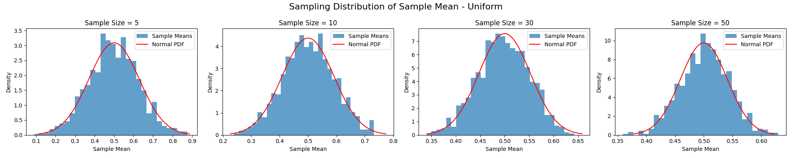
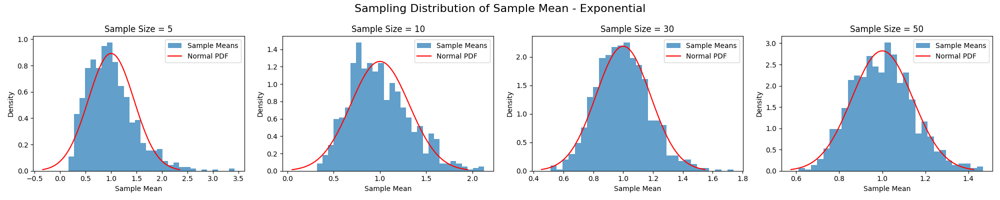
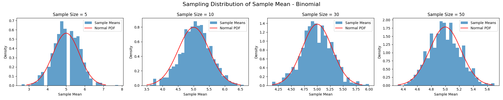

# Problem 1

# Exploring the Central Limit Theorem through Simulations

The Central Limit Theorem (CLT) is a fundamental concept in statistics, asserting that the sampling distribution of the sample mean approaches a normal distribution as the sample size increases, regardless of the population's original distribution. This project uses simulations to demonstrate the CLT in action, exploring how different population distributions converge to normality and reflecting on its practical significance.

---

## 1. Simulating Sampling Distributions

We will simulate sampling distributions from three distinct population distributions:

- **Uniform Distribution**: A continuous distribution with equal probability between 0 and 1.
- **Exponential Distribution**: A continuous, right-skewed distribution with a scale parameter of 1.
- **Binomial Distribution**: A discrete distribution with 10 trials and a success probability of 0.5.

For efficiency, rather than generating a large population dataset and sampling from it, we will generate samples directly from these distributions using Python's NumPy library. This approach is equivalent to sampling with replacement from an infinite population, which aligns with the theoretical framework of the CLT.

---

## 2. Sampling and Visualization

For each distribution, we will:
- Draw samples of sizes 5, 10, 30, and 50.
- Calculate the sample mean for each sample.
- Repeat this process 1000 times to construct the sampling distribution of the sample mean.
- Plot histograms of the sample means and overlay the theoretical normal distribution predicted by the CLT.

### Python Code Implementation

```python
import numpy as np
import matplotlib.pyplot as plt
from scipy.stats import norm

# Define population parameters
distributions = {
    'Uniform': (0.5, np.sqrt(1/12)),  # mean = 0.5, std = sqrt(1/12) ≈ 0.289
    'Exponential': (1, 1),            # mean = 1, std = 1
    'Binomial': (5, np.sqrt(2.5))     # mean = 5, std = sqrt(2.5) ≈ 1.581
}

sample_sizes = [5, 10, 30, 50]
num_repeats = 1000

for dist_name, (mu, sigma) in distributions.items():
    fig, axes = plt.subplots(1, 4, figsize=(20, 4))
    fig.suptitle(f'Sampling Distribution of Sample Mean - {dist_name}', fontsize=16)
    
    # Define sampling function based on distribution
    if dist_name == 'Uniform':
        population_func = lambda size: np.random.uniform(0, 1, size)
    elif dist_name == 'Exponential':
        population_func = lambda size: np.random.exponential(1, size)
    elif dist_name == 'Binomial':
        population_func = lambda size: np.random.binomial(10, 0.5, size)
    
    for i, m in enumerate(sample_sizes):
        sample_means = []
        for _ in range(num_repeats):
            sample = population_func(m)
            sample_mean = np.mean(sample)
            sample_means.append(sample_mean)
        
        ax = axes[i]
        ax.hist(sample_means, bins=30, density=True, alpha=0.7, label='Sample Means')
        
        # Theoretical normal distribution per CLT
        x = np.linspace(mu - 3*sigma/np.sqrt(m), mu + 3*sigma/np.sqrt(m), 100)
        ax.plot(x, norm.pdf(x, mu, sigma/np.sqrt(m)), 'r-', label='Normal PDF')
        
        ax.set_title(f'Sample Size = {m}')
        ax.set_xlabel('Sample Mean')
        ax.set_ylabel('Density')
        ax.legend()
    
    plt.tight_layout()
    plt.show()
```

### Expected Output

- **Uniform Distribution**: Histograms will appear approximately normal even at a sample size of 5, with the spread decreasing as sample size increases.
- **Exponential Distribution**: For a sample size of 5, the histogram will be right-skewed, but it will become more symmetric and bell-shaped by sample sizes of 30 and 50.
- **Binomial Distribution**: At a sample size of 5, the histogram may show some discreteness due to the discrete nature of the population, but it will smooth out and resemble a normal distribution by sample sizes of 30 and 50.

The red curve in each plot represents the theoretical normal distribution with mean equal to the population mean ($\mu$) and standard deviation equal to the population standard deviation divided by the square root of the sample size ($\sigma / \sqrt{m}$).







---

## 3. Parameter Exploration

### Influence of Population Shape

- **Uniform Distribution**: Being symmetric, its sampling distribution converges to normality quickly, appearing nearly normal even at small sample sizes.
- **Exponential Distribution**: As a skewed distribution, its sampling distribution requires larger sample sizes to lose its skewness and approach normality.
- **Binomial Distribution**: With $p = 0.5$, it is symmetric but discrete. For small sample sizes, the discreteness is noticeable, but it smooths out as sample size increases.

### Impact of Population Variance
According to the CLT, the variance of the sampling distribution of the sample mean is $\sigma^2 / m$, where $\sigma^2$ is the population variance and $m$ is the sample size. In the plots:

- The **uniform distribution** has $\sigma^2 = 1/12 \approx 0.0833$, resulting in narrow histograms even for small $m$.
- The **exponential distribution** has $\sigma^2 = 1$, so its histograms are wider than those of the uniform distribution for the same $m$.
- The **binomial distribution** has $\sigma^2 = 2.5$, leading to the widest histograms for a given sample size among the three.

As $m$ increases, the histograms narrow for all distributions, reflecting the decrease in variance ($\sigma^2 / m$).

---

## 4. Practical Applications

The CLT is invaluable in real-world scenarios:
- **Estimating Population Parameters**: It allows the use of normal-based confidence intervals and hypothesis tests for sample means, even when the population is not normal, as long as the sample size is sufficiently large.
- **Quality Control in Manufacturing**: In monitoring process averages (e.g., product weights), the CLT justifies using normal distribution-based control charts.
- **Predicting Outcomes in Financial Models**: The CLT supports the assumption that aggregated returns or errors in financial data approximate normality, facilitating risk assessment and portfolio management.

---

## Discussion

These simulations vividly illustrate the Central Limit Theorem. The uniform distribution’s symmetry leads to rapid convergence, with sample means appearing normal even at $m = 5$. The exponential distribution, with its skewness, shows a gradual transition, requiring larger sample sizes (e.g., 30 or 50) to resemble a normal distribution. The binomial distribution, despite its discreteness, smooths into a bell shape as sample size increases, aligning with the CLT’s predictions.

The rate of convergence depends on the population’s shape—symmetric distributions converge faster than skewed ones. Additionally, the population variance influences the spread of the sampling distribution, with larger variances producing wider histograms for the same sample size, though this spread diminishes as $m$ grows.

The CLT’s theoretical expectation—that the sample mean’s distribution approaches $N(\mu, \sigma^2 / m)$ — is confirmed by the close match between the histograms and the overlaid normal curves, especially for larger sample sizes. This underscores the CLT’s power in enabling statistical inference across diverse applications, bridging theory and practice in a profound way.